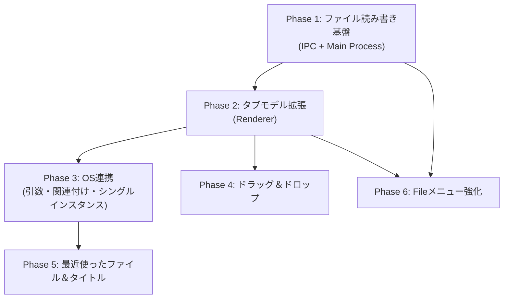

# Sainte Devote — OS ネイティブ Markdown エディタ化 計画

## 対象プラットフォーム

| | Windows | macOS | Linux |
|--|---------|-------|-------|
| ビルド形式 | NSIS / Portable | DMG / ZIP | AppImage / deb |
| サポート状況 | ✅ フルサポート | ✅ フルサポート | ✅ ベストエフォート |

## 現状分析

Sainte Devote は現在、**自己完結型のメモ帳アプリ**として動作しています。

| 機能 | 現状 | あるべき姿 |
|------|------|-----------|
| ファイルを開く | ❌ なし | エクスプローラーからダブルクリック / メニューから「開く」 |
| ファイルを保存 | ⚠️ 名前を付けて保存のみ | Ctrl+S で上書き保存 / 名前を付けて保存 |
| ファイル関連付け | ❌ なし | `.md` ファイルを Sainte Devote で開ける |
| ドラッグ＆ドロップ | ❌ なし | `.md` ファイルをウィンドウにD&Dで開く |
| 最近使ったファイル | ❌ なし | OS の「最近使った項目」に表示 |
| コマンドライン起動 | ❌ なし | `sainte-devote file.md` で開ける |
| タブとファイルの紐付け | ❌ IndexedDB のみ | 必要に応じてファイルパスを保持 |

## 設計原則

> [!IMPORTANT]
> **シームレスなオートセーブと、保存先の透過的な移行が基本コンセプトです。**

このアプリの基本コンセプトは「起動したらすぐ書けるスクラッチパッド」です。ユーザーに「保存」という行為を極力意識させません。

| 状態 | スクラッチタブ | ファイル紐付きタブ |
|--|---|---|
| データの保存先 | IndexedDB | ローカルファイルシステム |
| 保存タイミング | **自動**（編集のたびにバックグラウンドで） | **自動**（編集のたびにバックグラウンドで） |
| アプリ終了・タブ閉じ | 意識せず閉じてOK（保存済み） | 意識せず閉じてOK（保存済み） |

ユーザーが「ファイルとして書き出したい」と明示的に操作（`Save As`など）した場合、**当該タブの IndexedDB 上のデータは裏で消去され、保存先がローカルファイルに完全に引き継がれます**。以後はユーザーが何も意識せずとも、入力するたびに自動的にローカルファイルに上書き保存され続けます。

---

## 実装計画

### Phase 1: ファイルの読み書き基盤（Main Process）

> [!NOTE]
> すべての Node.js / fs アクセスは Main Process 側で行い、セキュリティモデル（contextIsolation + IPC allowlist）を維持します。

#### 1-1. IPC チャネルの追加

[preload.js](file:///C:/Users/user/dev/sainte-devote/src/preload.js) の `SEND_CHANNELS` / `RECEIVE_CHANNELS` に以下を追加：

| 方向 | チャネル名 | 用途 |
|------|-----------|------|
| Renderer → Main | `open-file-dialog` | 「ファイルを開く」ダイアログを表示 |
| Renderer → Main | `save-file-to-path` | 既知パスに上書き保存（オートセーブ用） |
| Main → Renderer | `file-opened` | 開いたファイルの内容 + パスを渡す |
| Main → Renderer | `save-file-to-path-success` | 上書き保存成功通知（必要に応じて） |

#### 1-2. Main Process にファイル操作ハンドラを追加

[main.js](file:///C:/Users/user/dev/sainte-devote/src/main.js) に以下を実装：

```javascript
// ファイルを開くダイアログ
ipcMain.handle('open-file-dialog', async () => {
  const result = await dialog.showOpenDialog(win, {
    filters: [
      { name: 'Markdown Files', extensions: ['md', 'markdown', 'txt'] },
      { name: 'All Files', extensions: ['*'] }
    ],
    properties: ['openFile', 'multiSelections']
  });
  // ファイルを読み込んで内容を返す
});

// 指定パスに上書き保存（Rendererからのオートセーブ要求）
ipcMain.on('save-file-to-path', (event, { filePath, content }) => {
  fs.writeFileSync(filePath, content, 'utf8');
});
```

#### 1-3. Preload Bridge の拡張

[preload.js](file:///C:/Users/user/dev/sainte-devote/src/preload.js) に `invoke`（`ipcRenderer.invoke`）メソッドも追加し、非同期の `handle` パターンに対応。

---

### Phase 2: Renderer のタブモデルとオートセーブ拡張

#### 2-1. タブにファイルパス情報を持たせる

[renderer.js](file:///C:/Users/user/dev/sainte-devote/src/renderer.js) の各タブの管理データに `filePath` プロパティを追加：

```javascript
// タブのメタデータ拡張
{
  id: 'tab-xxx',
  title: 'README.md',
  filePath: '/Users/.../README.md',  // null ならスクラッチタブ（IndexedDB保存）
  // 常にオートセーブされるため isDirty（未保存フラグ）は不要
}
```

#### 2-2. シームレスなオートセーブフローの実装

エディタの内容が変更された際（`onDidChangeModelContent`）の保存ロジックを以下のように分岐・統合します。

```
編集イベント発生 (ディレイ付きで実行)
  │
  ├─ filePath == null（スクラッチタブ）
  │    → 既存通り、IndexedDB にオートセーブ
  │
  └─ filePath != null（ファイル紐付きタブ）
       → IPC経由で Main Process に内容を送り、ファイルにオートセーブ
       → (IndexedDB には保存しない)
```

**ファイルに書き出す操作（ファイル化：`Save As`）のフロー：**

1. ユーザーが `Save As` でローカルファイルを選択。
2. そのファイルに現在の内容を書き出す。
3. タブに `filePath` を紐付ける。
4. **IndexedDB 上に存在していた当該タブのデータ（バックアップ）を裏で削除する。**
5. 以後、そのタブのオートセーブ先は IndexedDB からローカルファイルに完全に切り替わる。

> [!IMPORTANT]
> この仕組みにより、ユーザーは「IndexedDB上の下書き」と「ローカルファイル」の二重管理を意識することなく、シームレスに作業を継続できます。

#### 2-3. 未保存確認ダイアログの完全廃止

**すべての状態（IndexedDB / ローカルファイル）でオートセーブが保証されるため、「保存しますか？」という確認ダイアログは完全に不要です。**
ユーザーは保存を気にすることなく、いつでもタブやウィンドウ、アプリ全体を即座に閉じることができます（メモ帳のように手動保存を強要しません）。

#### 2-4. タブタイトルの表示

- ファイルと紐付いたタブ → ファイル名を表示（例: `README.md`）
- スクラッチタブ → 現行通り（例: `Untitled 1`）
- ※常に保存済みと同義のため、未保存を示す `●` などのマークは表示しません。

#### 2-5. 「ファイルを開く」UI

- File メニューに **Open File** (`Ctrl+O`) を追加
- コマンドパレットに以下のコマンドを追加：

| コマンド名 | 動作 |
|----------|------|
| `Open File` | ファイル選択ダイアログを開き、ファイル紐付きタブとして開く |
| `Save As` / `Save to File` | 現在のタブを任意のファイルとして書き出す |
| `Save` | ユーザーの「手動保存したい」という習慣を満たすための機能（実態は常に保存されているため、何もせず UI Feedback を返す程度） |

> [!TIP]
> 既存のローカルファイルを開いた場合も、そのタブは最初から `filePath` を持ち、以降の編集はファイルへ直接オートセーブされます。IndexedDB に二重で保存されることはありません。

---

### Phase 3: OS 連携

> [!IMPORTANT]
> 3プラットフォームでファイルの受け取り方が**異なる**ため、それぞれ実装が必要です。

| 操作 | Windows | macOS | Linux |
|------|---------|-------|-------|
| ファイルマネージャからダブルクリック | `process.argv` に追加 | `open-file` イベント | `process.argv` に追加 |
| すでに起動中にファイルを開く | `second-instance` の `argv` | `open-file` イベント | `second-instance` の `argv` |
| ファイル関連付けの登録 | NSIS レジストリ登録（自動） | `Info.plist`（自動） | `.desktop` の `MimeType`（自動） |
| ショートカットキー修飾 | `Ctrl` | `Cmd` | `Ctrl` |
| タイトルバー | `titleBarOverlay` ✅ | `titleBarStyle: 'hidden'` ✅ | WM 依存（⚠️ 後述） |

#### 3-1. コマンドライン引数でファイルを開く（Windows / Linux）

Windows・Linux ではファイル関連付け・ダブルクリック時にファイルパスが `process.argv` に渡されます。
[main.js](file:///C:/Users/user/dev/sainte-devote/src/main.js) で解析：

```javascript
// ファイルパス抽出ユーティリティ（Windows / Linux 共通）
function extractFilePathsFromArgv(argv) {
  // dev 時: electron . file.md → argv[0]=electron, argv[1]='.', argv[2]=file.md
  // prod 時: app.exe file.md  → argv[0]=app.exe, argv[1]=file.md
  const startIndex = isDev ? 2 : 1;
  return argv.slice(startIndex)
    .filter(arg => !arg.startsWith('-'))  // フラグを除外
    .filter(arg => /\.(md|markdown|txt)$/i.test(arg))
    .map(arg => path.resolve(arg));       // 相対パスを絶対パスに正規化
}

app.whenReady().then(() => {
  createWindow();
  const filePaths = extractFilePathsFromArgv(process.argv);
  if (filePaths.length > 0) {
    win.webContents.on('did-finish-load', () => {
      filePaths.forEach(fp => openFileInRenderer(fp));
    });
  }
});
```

#### 3-2. シングルインスタンス制御（全プラットフォーム共通）

すでに起動中の場合、2つ目のインスタンスを起動せず既存ウィンドウにファイルを送る：

```javascript
const gotTheLock = app.requestSingleInstanceLock();
if (!gotTheLock) {
  app.quit();
} else {
  app.on('second-instance', (event, argv) => {
    // Windows: ファイル関連付け経由で2つ目が起動された場合 argv にパスが入る
    const filePaths = extractFilePathsFromArgv(argv);
    filePaths.forEach(fp => openFileInRenderer(fp));
    if (win) {
      if (win.isMinimized()) win.restore();
      win.focus();
    }
  });
}
```

#### 3-3. macOS 固有：`open-file` イベント

macOS では Finder からファイルを開くと `process.argv` ではなく `open-file` イベントが発火します。
このイベントは `app.whenReady()` **より前に**発火する可能性があるため、キューイングが必要：

```javascript
const filePathsToOpen = []; // キュー

// macOS: ready 前でも発火する
app.on('open-file', (event, filePath) => {
  event.preventDefault();
  if (win && !win.isDestroyed()) {
    openFileInRenderer(filePath);
  } else {
    filePathsToOpen.push(filePath);
  }
});

// ready 後にキューを処理
app.whenReady().then(() => {
  createWindow();
  win.webContents.on('did-finish-load', () => {
    filePathsToOpen.forEach(fp => openFileInRenderer(fp));
    filePathsToOpen.length = 0;
  });
});
```

#### 3-4. ファイル関連付け（electron-builder 設定）

[package.json](file:///C:/Users/user/dev/sainte-devote/package.json) の `build` セクションに追加：

```json
{
  "build": {
    "fileAssociations": [
      {
        "ext": ["md", "markdown"],
        "name": "Markdown File",
        "description": "Markdown Document",
        "mimeType": "text/markdown",
        "role": "Editor",
        "icon": "assets/icon"
      }
    ],
    "win": {
      "target": ["nsis", "portable"],
      "icon": "assets/icon.ico"
    },
    "nsis": {
      "oneClick": false,
      "perMachine": false,
      "allowToChangeInstallationDirectory": true
    },
    "mac": {
      "target": ["zip", "dmg"],
      "category": "public.app-category.utilities",
      "icon": "assets/icon.icns"
    },
    "linux": {
      "target": ["AppImage", "deb"],
      "category": "Utility",
      "icon": "assets/icon.png",
      "mimeTypes": ["text/markdown", "text/x-markdown"]
    }
  }
}
```

> [!TIP]
> **Windows**: NSIS インストーラーがレジストリにファイル関連付けを登録。「プログラムから開く」リストに表示されます。
> **macOS**: `Info.plist` に自動で `CFBundleDocumentTypes` が追加され、Finder で関連付けられます。
> **Linux**: `deb` パッケージは `.desktop` ファイルに `MimeType=text/markdown` を登録し、`xdg-mime` 経由で関連付けられます。AppImage は自己完結型のため、OS レベルの関連付けは自動登録されません（ユーザーが手動設定、または [AppImageLauncher](https://github.com/TheAssassin/AppImageLauncher) 等を使用）。

#### 3-5. Linux 固有の注意事項

**タイトルバー**

現在 `titleBarStyle: 'hidden'` + `titleBarOverlay` を使用していますが、Linux（X11/Wayland）ではウィンドウマネージャ（WM）によって挙動が異なります：

| WM | `titleBarOverlay` | `titleBarStyle: 'hidden'` |
|----|-------------------|---------------------------|
| GNOME (Mutter) | ❌ 未サポート | ✅ 動作 |
| KDE (KWin) | ❌ 未サポート | ✅ 動作 |
| Sway / Wayland | ❌ 未サポート | ⚠️ WM 依存 |

対応方針：
```javascript
// Linux ではカスタムタイトルバーを無効にしネイティブ装飾を使用
const isLinux = process.platform === 'linux';
const monacoSettings = {
  // ...
  titleBarStyle: isLinux ? 'default' : 'hidden',
  ...(isLinux ? {} : {
    titleBarOverlay: {
      color: '#f9fafb',
      symbolColor: '#374151',
      height: 40,
    }
  }),
  frame: isLinux,  // Linux ではネイティブフレームを使用
};
```

> [!NOTE]
> Linux でカスタムタイトルバーを無効にする場合、`#titlebar` の CSS 表示を `process.platform` に応じて調整する必要があります。ウィンドウコントロール（閉じる/最小化/最大化）は WM が提供するため、HTML 側での実装は不要です。

---

### Phase 4: ドラッグ＆ドロップ対応

> [!WARNING]
> Electron 42 では `File.path` プロパティは**非推奨**です。代わりに `webUtils.getPathForFile()` を使用します。
> この API は Preload スクリプト経由で Renderer に公開する必要があります。

#### 4-1. Preload に `getFilePath` を追加

[preload.js](file:///C:/Users/user/dev/sainte-devote/src/preload.js):

```javascript
const { webUtils } = require('electron');

contextBridge.exposeInMainWorld('electron', {
  // ... 既存メソッド ...
  getFilePath: (file) => webUtils.getPathForFile(file),  // 全プラットフォーム共通
});
```

#### 4-2. Renderer 側のドロップゾーン

ウィンドウ全体をドロップターゲットにし、`.md`/`.markdown`/`.txt` ファイルのドロップを受け付け：

```javascript
document.addEventListener('dragover', e => e.preventDefault());
document.addEventListener('drop', e => {
  e.preventDefault();
  const files = [...e.dataTransfer.files]
    .filter(f => /\.(md|markdown|txt)$/i.test(f.name));
  files.forEach(f => {
    // webUtils 経由でパスを取得（全プラットフォーム共通）
    const filePath = window.electron.getFilePath(f);
    window.electron.send('open-dropped-file', filePath);
  });
});
```

#### 4-3. ドロップ時のビジュアルフィードバック

ドラッグ中にウィンドウ全体にオーバーレイを表示（「ここにファイルをドロップ」）。
全プラットフォームで動作は同じです。

---

### Phase 5: 最近使ったファイル＆ウィンドウタイトル

#### 5-1. 最近使ったファイル（OS 連携）

```javascript
// ファイルを開いた / 保存した際に
app.addRecentDocument(filePath);
```

| プラットフォーム | 表示場所 | サポート |
|----------------|---------|----------|
| Windows | タスクバーのジャンプリスト | ✅ |
| macOS | Dock メニュー「最近使った項目」 | ✅ |
| Linux | ❌ Electron 非対応 | ⚠️ アプリ内で独自管理 |

> [!NOTE]
> Linux では `app.addRecentDocument()` が機能しないため、アプリ内に「最近開いたファイル」リストを localStorage 等で独自管理し、コマンドパレットや File メニューから表示する方式でカバーします。

#### 5-2. ウィンドウタイトルの更新（全プラットフォーム共通）

アクティブタブのファイル名をウィンドウタイトルに反映：

```
README.md — Sainte Devote
```

スクラッチタブの場合：

```
Untitled 1 — Sainte Devote
```

macOS では `win.setRepresentedFilename(filePath)` も呼び出し、タイトルバーのプロキシアイコンを有効にします（ファイル → Finder で表示など）。

---

### Phase 6: File メニューの強化

[main.js](file:///C:/Users/user/dev/sainte-devote/src/main.js) の `createMenu()` を拡張：

```
File
├── New Tab                Ctrl+N
├── Open File...           Ctrl+O
├── ─────────────
├── Save                   Ctrl+S
├── Save As...             Ctrl+Shift+S
├── ─────────────
├── Close Tab              Ctrl+W
├── ─────────────
├── Export All Tabs (.zip) Ctrl+Shift+E
├── ─────────────
└── Quit
```

**コマンドパレット（`Ctrl+P`）に追加するコマンド：**

| コマンド | 動作 |
|---------|------|
| `Open File` | ファイル選択ダイアログ |
| `Save` | 上書き保存 / 名前を付けて保存 |
| `Save As` | 名前を付けて保存 |
| `Close Tab` | アクティブタブを閉じる |
| `Export All Tabs` | 既存 |

**一般的なメモ帳との機能対応表：**

| メモ帳の操作 | Sainte Devote での対応 |
|--------------|---------------------|
| ファイル > 新規 | New Tab (`Ctrl+N`) |
| ファイル > 開く | Open File (`Ctrl+O`) → 新タブでファイルを開く |
| ファイル > 保存 | Save (`Ctrl+S`) → ファイル有りは上書き、スクラッチは Save As |
| ファイル > 名前を付けて保存 | Save As (`Ctrl+Shift+S`) |
| ファイル > 閉じる | Close Tab (`Ctrl+W`) → 未保存時は確認ダイアログ |
| ファイル > 終了 | Quit |
| エクスプローラーから開く | ダブルクリック / D&D / コマンドライン |
| 「最近使ったファイル」 | OS 連携（Win/Mac）+ アプリ内リスト（Linux） |

---

## 実装順序と依存関係



## 変更対象ファイル

| ファイル | 変更内容 |
|---------|---------|
| [main.js](file:///C:/Users/user/dev/sainte-devote/src/main.js) | ファイル読み書きハンドラ、コマンドライン解析、シングルインスタンス、メニュー拡張、open-file イベント、最近使ったファイル、Linux タイトルバー分岐 |
| [preload.js](file:///C:/Users/user/dev/sainte-devote/src/preload.js) | IPC チャネル追加（allowlist）、`invoke` メソッド追加、`webUtils.getPathForFile` 公開 |
| [renderer.js](file:///C:/Users/user/dev/sainte-devote/src/renderer.js) | タブの filePath 管理、Ctrl+S 保存、ドラッグ＆ドロップ、UI フィードバック、Linux 用最近使ったファイル管理 |
| [index.html](file:///C:/Users/user/dev/sainte-devote/index.html) | ドロップオーバーレイ用 DOM 要素 |
| [main.css](file:///C:/Users/user/dev/sainte-devote/src/main.css) | ドロップオーバーレイ、未保存インジケーター、Linux ネイティブフレーム時のレイアウト調整 |
| [package.json](file:///C:/Users/user/dev/sainte-devote/package.json) | `fileAssociations` 設定追加、Linux ビルドターゲット拡張（deb 追加） |

## プラットフォーム別チェックリスト

| 機能 | Windows | macOS | Linux |
|------|---------|-------|-------|
| ファイルを開くダイアログ | ✅ 共通 | ✅ 共通 | ✅ 共通 |
| Ctrl/Cmd+S 上書き保存 | ✅ Ctrl+S | ✅ Cmd+S | ✅ Ctrl+S |
| コマンドライン引数 | ✅ `process.argv` | ✅ `open-file` | ✅ `process.argv` |
| シングルインスタンス | ✅ `second-instance` | ✅ `open-file` | ✅ `second-instance` |
| ファイル関連付け | ✅ NSIS レジストリ | ✅ Info.plist | ✅ deb: `.desktop` / ⚠️ AppImage: 手動 |
| ドラッグ＆ドロップ | ✅ `webUtils` | ✅ `webUtils` | ✅ `webUtils` |
| 最近使ったファイル（OS） | ✅ ジャンプリスト | ✅ Dock メニュー | ❌ アプリ内で独自管理 |
| カスタムタイトルバー | ✅ `titleBarOverlay` | ✅ `titleBarStyle` | ❌ ネイティブフレーム使用 |
| ウィンドウタイトル更新 | ✅ 共通 | ✅ + プロキシアイコン | ✅ 共通 |

## セキュリティ上の注意事項

> [!CAUTION]
> - ファイルパスのバリデーション: Renderer から受け取ったパスを Main 側で検証（パストラバーサル防止）
> - 新しい IPC チャネルは必ず `preload.js` の allowlist に追加
> - `nodeIntegration: false` / `contextIsolation: true` は変更しない
> - `File.path`（非推奨）は使わず `webUtils.getPathForFile()` を使用

## 見積もり

| Phase | 作業量 | 優先度 |
|-------|-------|-------|
| Phase 1: ファイル読み書き基盤 | 小 | 🔴 最優先 |
| Phase 2: タブモデル拡張 | 中 | 🔴 最優先 |
| Phase 3: OS 連携 | 中 | 🟠 高 |
| Phase 4: ドラッグ＆ドロップ | 小 | 🟡 中 |
| Phase 5: 最近使ったファイル | 小 | 🟢 低 |
| Phase 6: File メニュー強化 | 小 | 🟠 高 |
